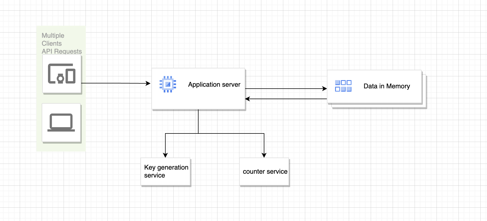

# The Problem we are solving in Shortening App (FINN)

I would like to briefly cover the process of implementing the URL shortening function.

* URL shortening: URL shortening is a technique for shortening long URLs on the World Wide Web. A server that provides a URL shortening function uses HTTP redirects to a client to a long URL.

* For example, when you want to share a URL with people, you don’t want to see the long URL you want to share. If people can read and infer the contents as shown below, it is not a big inconvenience.

  - https://www.nhm.ac.uk/discover/what-are-spider-webs-made-of.html

* However, if the URL becomes long due to an identifier such as a01626108 that the user does not know, the people don’t want to read it.

  - https://www.linkedin.com/in/jaeyeoul-ahn-a01626108/
  - https://i.guim.co.uk/img/media/ec27f69b7e4ac14838e8f71842a4cc6db3b8d69c/112_4_1179_708/master/1179.jpg

So, You can shorten it to very short using services like bitly.com.

### Getting Started:
Create Shorten URL
* How short does it have to be for a person to feel short? According to the thesis ‘The Magical Number Seven, Plus or Minus Two Some Limits on Our Capacity for Processing Information by George A. Miller, a cognitive psychologist at Harvard University in 1956, a person can easily remember about 7 (+-2) words. This is called Miller’s law.

* Of course, a lot of further research has been done over the past 60 years. There is also a study result that there is no reason why there are always seven. There are also studies that say that when you read it by mouth, it is set in 2 seconds, and there are studies that say it is between 3 and 5 characters instead of 7 characters. (100 Things Every Designer Needs to Know About People — Susan M. Weinschenk)

* If so, how long should the Shorten URL be? First of all, I’m going to try to make 7 as a standard. At least according to my standards, if it is too short, the number of URLs that can be expressed decreases, so it would be difficult to implement.

* Bitly was also thinking of Miller’s Law, they are already giving the answer in 7 digits identifier!

## Resource identifier:
* We need to create an identifier that corresponds to the request URL. We try to use 7 digits as much as possible, as Miller’s Law discussed above. It consists of two requirements as follows.

  - 7-character identifier required
  - Each identifier must be unique


## Encoding — Number System

* I think it would be good to create an identifier using a DB sequence and use it. But there’s a problem. What if it exceeds 7 digits? In fact, it seems like it would be ok because it is about 1,000,000 cases. Considering a larger system with more than 10 million people, I think we need more identifiers.

* Since 1000000 is expressed as a decimal number, how about expressing it as a hexadecimal number? A total of 268,435,455 can be made. You can make 268 times more.

  - 1000000 → f4240
  - 9999999 →98967f
  - 268435455 → fffffff

* Then, if you express it as a 62-digit number, you can express more, right? A thought that comes to mind right now is to use Base62.

## Base 62!
* Oh, you’ve come a long way. I wanted to show you how to encode and express it in a form that fits the base system. Base 64 was conceived of as a 64-digit number processing, but in general, it was the string processing method of the RFC4648 standard. The padding value is added and the expression is longer.

* Our goal is to create a URL. If you use Base64 = you cannot use it because it is a reserved word for URL.

* Also, 62(+) and 63(/) are difficult to use. So, in the URL Safe Base 64 that appeared, the existing 62 is expressed as (-) and 63 as (_). However, padding is expressed with =. This expression causes confusion in URL reserved words and grammar rules. If it is written as below, how will it be processed by the HTTP client?

  - HTTP://mydomain.ly/TWFuTQ==

* So, it seems that base 62, which is an expression excluding two special characters and padding characters, is commonly used in URLs. If I had to add it, it would be possible to use up to base 73, including the 11 allowed special characters $-_.+!*’(), but it is not useful because the pronunciation is too long to read or feel short.

* Although it is not compulsory, I did not choose Base64 considering the overlapping use of URL reserved words and padding characters = and UX design. I think it’s a better choice to use only alphabets and numbers. It will be mentioned at the end of the article, but it is possible to express a large amount in a short way.

* If the character corresponding to an octet is reserved in a scheme, the octet must be encoded. The characters “;”, “/”, “?”, “:”, “@”, “=” and “&” are the characters which may be reserved for special meaning within a scheme.

* Thus, only alphanumerics, the special characters “$-_.+!’(),”, and reserved characters used for their reserved purposes may be used unencoded within a URL. https://datatracker.ietf.org/doc/html/rfc1738#section-2.2*


##  We need base62!
* Base62 is not in the RFC4648 standard. In the case of Base 62, ISO 10646, UTF-62 is introduced in ‘A base62 transformation format of ISO 10646 for multilingual identifiers’. If you read the paper, there is content that converts UCS-4 code to UTF-62 code and encodes it, which I will not cover in this article.

* So, let’s implement Base62, which is expressed from decimal to 64!

Let’s start with binary numbers.

```javascript
const bi = (number) => {
    let quotient = number;
    let reminder = [];

    while (quotient >= 2){
        reminder.push(quotient % 2);
        quotient = Math.floor(quotient / 2);
    }
    quotient = quotient + '';

    while (reminder.length > 0) {
        quotient = quotient + reminder.pop();
    }

    return quotient;
}
```
Result:
```log
1010 at bi(10)
```

I put 10 and it was converted to 1010, and it works well as 1*2 ³ + 1*2 ¹ = 10. Let’s change base 2 to 16 to make hexadecimal.


```javascript
const hex = (number) => {
    let quotient = number;
    let reminder = [];

    while (quotient >= 16){
        reminder.push(quotient % 16);
        quotient = Math.floor(quotient / 16);
    }
    quotient = quotient + '';

    while (reminder.length > 0) {
        quotient = quotient + reminder.pop();
    }

     return quotient;
}
```
Result:
```log
3148 at hex(1000)
```

When I put in a value of 1000, 3148 was printed. It came out well as 3*16² + 14*16¹ + 8*16⁰. However, since the characters that can be expressed are Arabic numerals 0 to 9, people who see it for the first time cannot know each digit.

3, 1, 4, 8 vs 3, 14, 8

In order to express 14, let’s match the alphabetic character table. 14 is the letter e, right?


```javascript
const hex = (number) => {
    let quotient = number;
    let reminder = [];
    let codes = ['0','1','2','3','4','5','6','7','8','9','a','b','c','d','e','f'];

    while (quotient >= 16){
        reminder.push(quotient % 16);
        quotient = Math.floor(quotient / 16);
    }

    quotient = codes[quotient];

    while (reminder.length > 0) {
        quotient = quotient + codes[reminder.pop()];
    }

     return quotient;
}
```

Result:
```log
3e8 at hex(1000)
```

Now, base62 is easy, right?

```javascript

   const base62 = (number) => {
    let quotient = number;
    let reminder = [];
    let codes = [
        '0','1','2','3','4','5','6','7','8','9',
        'a','b','c','d','e','f','g','h','i','j','k','l','m','n','o','p','q','r','s','t','u','v','w','x','y','z',
        'A','B','C','D','E','F','G','H','I','J','K','L','M','N','O','P','Q','R','S','T','U','V','W','X','Y','Z',
    ];

    while (quotient >= 62){
        reminder.push(quotient % 62);
        quotient = Math.floor(quotient / 62);
    }

    quotient = codes[quotient];

    while (reminder.length > 0) {
        quotient = quotient + codes[reminder.pop()];
    }

     return quotient;
}

Result:
```log
g8 at base62(1000)
```

Putting in the decimal number 1000 gives g8. The maximum 7-digit value expressed in 62 digits is ZZZZZZZ. 3521614606207 in decimal. You can now map a total of about 3.5 trillion URLs using a total of 7 characters.

and we are done and get an encoding alogrithm for base62.

### with more improvements we will get the function we use in our app to be:

```javascript
keyGenerator = async (number): Promise<string> => {
  const codes =
    '0123456789abcdefghijklmnopqrstuvwxyzABCDEFGHIJKLMNOPQRSTUVWXYZ';
  const result = [];
  while (number >= 62) {
    result.push(codes[number % 62]);
    number = Math.floor(number / 62);
  }
  result.push(codes[number]);
  return result.reverse().join('');
};

```

> Note: This solution 3.5 trillion URLs using a total of 7 characters.

## Function Usage and Output

The `keyGenerator` function generates a unique key for each URL using a counter. The input for this function is a number obtained from a counter that is increased by 1 with each call for a new URL. This mechanism ensures that the generated output will be unique for each URL, and you won't encounter collision problems.

> Note: The counter is incremented by 1 for each new URL, ensuring a distinct value for every generated key. This process guarantees that the generated keys are unique and suitable for avoiding collisions in the system.

Enjoy the peace of mind that comes with a reliable key generation mechanism!

> Note: Our implementation is done only for one instance so our counter will be used only from this instance.

## Flow for implemented solution 


Here is a screenshot of our app in action:

