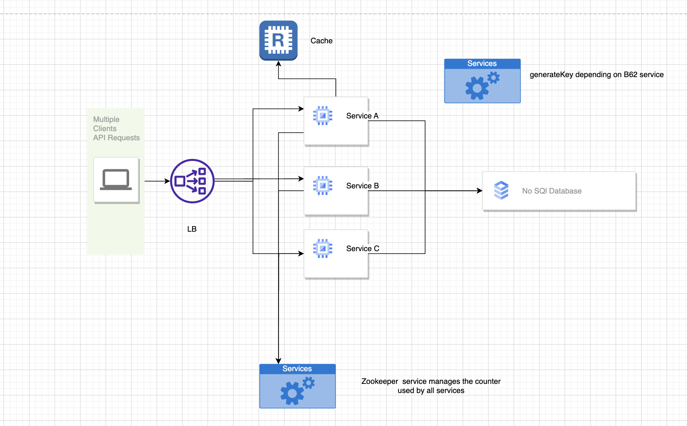

# How to enhance the solution

## points:
 * use multiple instances of the app to handle the load with load balancer.
 *  use redis to cache the most used urls. 
 *  use a tool to manage the counter used by all services to generate the key, like Apache zookeeper.

> Note: ZooKeeper is a centralized service for maintaining configuration information, naming, providing distributed synchronization, and providing group services. All of these kinds of services are used in some form or another by distributed applications. Each time they are implemented there is a lot of work that goes into fixing the bugs and race conditions that are inevitable. Because of the difficulty of implementing these kinds of services, applications initially usually skimp on them, which make them brittle in the presence of change and difficult to manage. Even when done correctly, different implementations of these services lead to management complexity when the applications are deployed.

 * use NoSql database like mongoDB to store the urls and the keys.

 > Note: MongoDB is a document database with the scalability and flexibility that you want with the querying and indexing that you need

 > Note: I'm suggestiong to go with NoSql database because it's more flexible and scalable than SQL database, and it's more suitable for our case, and we will not depend on relation between tables in our solution.

## Flow for my suggestions to improve the solution 

Here is a screenshot of our app in action:

